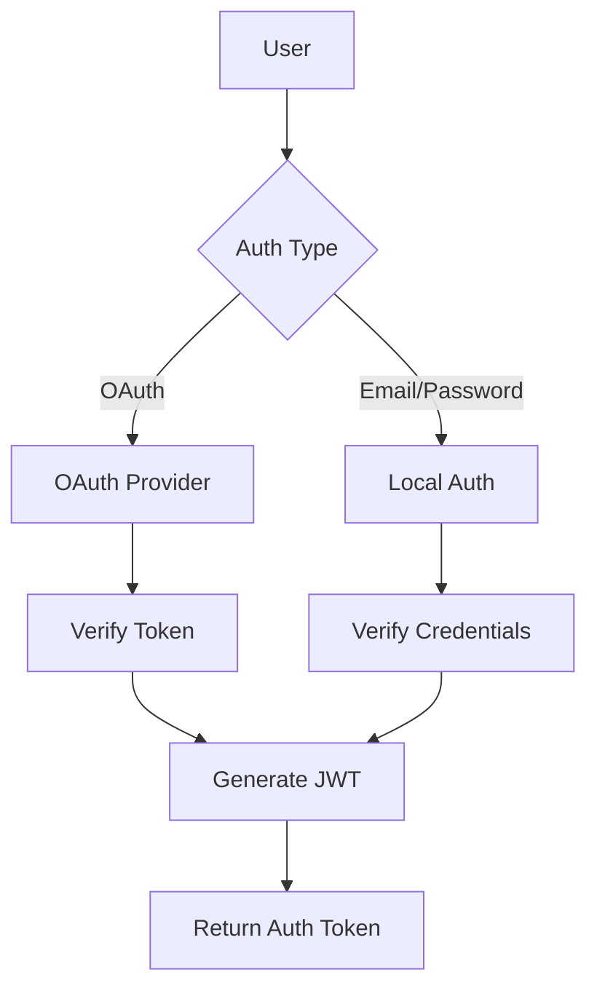

# Authentication Service Documentation

## Overview
The Authentication Service handles user authentication and authorization in the grocery delivery platform. It supports multiple authentication methods including OAuth2 with Google and Facebook, as well as traditional email/password authentication.

## Features
- OAuth2 integration (Google, Facebook)
- JWT token management
- Role-based access control
- Session management
- Password hashing and security
- Token refresh mechanism

## Authentication Flow


## Components

### 1. Authentication Models

#### User Model
```python
class User:
    id: str
    email: str
    password_hash: Optional[str]
    full_name: str
    role: UserRole
    oauth_provider: Optional[str]
    oauth_id: Optional[str]
    is_active: bool
    created_at: datetime
    last_login: datetime
```

#### Token Model
```python
class Token:
    access_token: str
    token_type: str
    expires_in: int
    refresh_token: str
    user_id: str
```

### 2. Authentication Methods
- Email/Password authentication
- Google OAuth2
- Facebook OAuth2
- JWT token authentication

## API Endpoints

### OAuth Routes
```python
POST /auth/google
POST /auth/facebook
POST /auth/logout
```

### Token Management
```python
POST /auth/token
POST /auth/token/refresh
POST /auth/token/revoke
```

### User Management
```python
GET /auth/me
PUT /auth/me/password
POST /auth/register
```

## Security Features

### Password Security
- Argon2 password hashing
- Password complexity requirements
- Brute force protection
- Password reset functionality

### Token Security
- Short-lived access tokens
- Secure token storage
- Token rotation
- Blacklisting compromised tokens

### OAuth Security
- State parameter validation
- PKCE support
- Secure callback handling
- Scope validation

## Database Schema

### Users Collection
```
users
├── email (unique index)
├── password_hash
├── oauth_provider
├── oauth_id
├── role
├── is_active
├── created_at
└── last_login
```

### Tokens Collection
```
tokens
├── user_id (index)
├── token_hash
├── expires_at (TTL index)
└── created_at
```

## Error Handling

### Authentication Errors
- Invalid credentials
- Expired tokens
- Invalid OAuth tokens
- Account lockout
- Rate limiting

### Recovery Procedures
1. Password reset flow
2. Account recovery
3. Token refresh
4. OAuth re-authentication

## Integration Points

### Internal Services
- User Service
- Authorization Service
- Notification Service

### External Services
- Google OAuth
- Facebook OAuth
- Email Service

## Monitoring

### Key Metrics
- Authentication success rate
- Token usage statistics
- OAuth provider status
- Failed login attempts
- Account lockouts

### Audit Logging
- Authentication attempts
- Password changes
- Token operations
- OAuth operations 