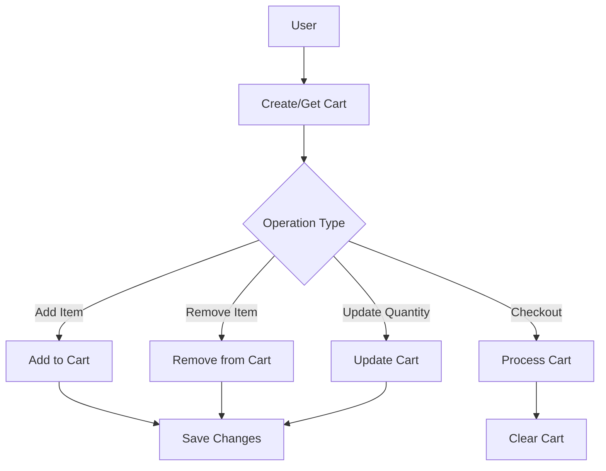

# Cart Service Documentation

## Overview
The Cart Service manages shopping cart functionality in the grocery delivery platform. It handles session-based cart management, item operations, and cart persistence.

## Features
- Session-based cart management
- Cart item CRUD operations
- Cart expiration handling
- Multi-store cart support
- Cart merging for guest checkout
- Price calculation and validation

## Cart Flow


## Components

### 1. Cart Models

#### Cart Item
```python
class CartItem:
    product_id: str
    store_id: str
    quantity: int
    unit_price: float
    name: str
    image_url: Optional[str]
    
    @property
    def subtotal(self) -> float:
        return self.quantity * self.unit_price
```

#### Cart
```python
class Cart:
    id: str
    session_id: str
    user_id: Optional[str]
    items: List[CartItem]
    created_at: datetime
    updated_at: datetime
    expires_at: datetime
    
    @property
    def total(self) -> float
        return sum(item.subtotal for item in self.items)
```

## API Endpoints

### Cart Management
```python
POST /cart/create
GET /cart/{session_id}
DELETE /cart/{session_id}
```

### Item Operations
```python
POST /cart/{session_id}/items
DELETE /cart/{session_id}/items/{product_id}
PUT /cart/{session_id}/items/{product_id}/quantity
```

### Cart Actions
```python
POST /cart/{session_id}/merge
POST /cart/{session_id}/clear
GET /cart/{session_id}/total
```

## Database Schema

### Carts Collection
```
carts
├── session_id (unique index)
├── user_id (index)
├── items: [
│   ├── product_id
│   ├── store_id
│   ├── quantity
│   └── unit_price
│ ]
├── created_at
├── updated_at
└── expires_at (TTL index)
```

## Features

### Session Management
- Automatic cart creation
- Session expiration handling
- Anonymous cart support
- User cart association

### Cart Operations
- Add/remove items
- Update quantities
- Clear cart
- Merge carts
- Calculate totals

### Validation
- Stock availability check
- Price validation
- Quantity limits
- Store availability

## Error Handling

### Common Errors
- Invalid session
- Expired cart
- Product not found
- Invalid quantity
- Stock unavailable

### Recovery Procedures
1. Session recovery
2. Cart restoration
3. Price revalidation
4. Stock verification

## Integration Points

### Internal Services
- Product Service
- Store Service
- User Service
- Payment Service

### External Services
- Price Service
- Inventory Service
- Analytics Service

## Performance

### Optimization Techniques
- MongoDB indexes
- Cache implementation
- Batch operations
- Async processing

### Scalability
- Horizontal scaling
- Session distribution
- Load balancing
- Data partitioning

## Monitoring

### Key Metrics
- Active carts
- Cart conversion rate
- Average cart value
- Abandoned carts
- Operation latency

### Logging
- Cart operations
- Error tracking
- Performance metrics
- User behavior

## Security

### Data Protection
- Session validation
- Price tampering prevention
- Rate limiting
- Data encryption

### Access Control
- User verification
- Session management
- Operation authorization
- Data isolation 