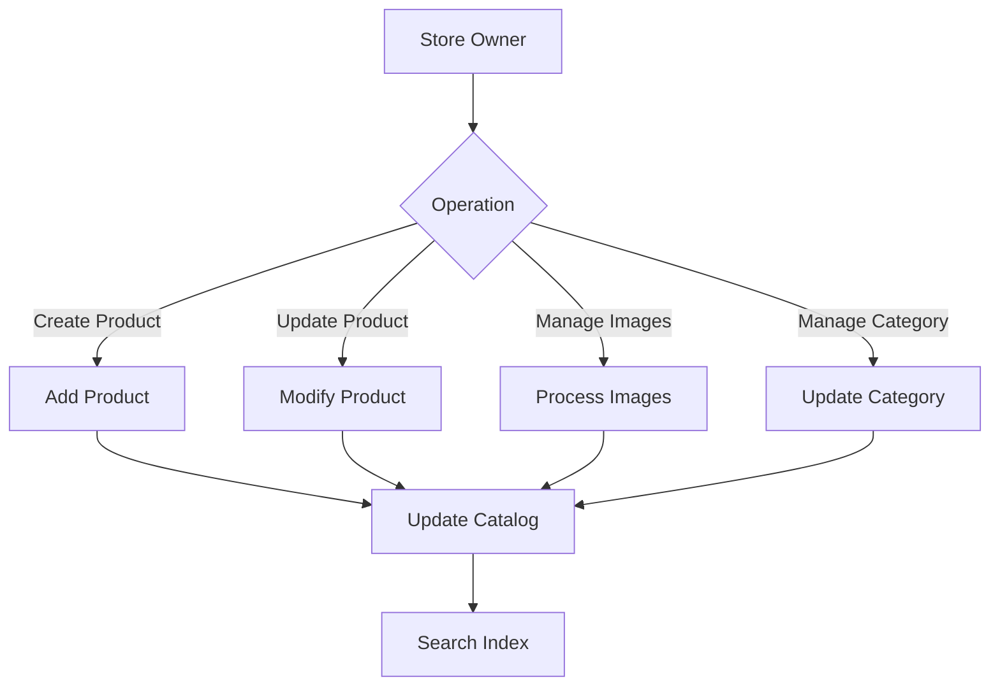

# Catalog Service Documentation

## Overview
The Catalog Service manages product catalogs, categories, and product information in the grocery delivery platform. It handles product management, image processing, and search functionality.

## Features
- Product CRUD operations
- Category management
- Image processing and storage
- Product search and filtering
- Price management
- Inventory tracking
- Store-specific catalogs

## Service Flow


## Components

### 1. Product Models

#### Product
```python
class Product:
    id: str
    store_id: str
    name: str
    description: str
    price: float
    category_id: str
    image_id: Optional[str]
    attributes: Dict[str, Any]
    stock_quantity: int
    is_available: bool
    created_at: datetime
    updated_at: datetime
```

#### Category
```python
class Category:
    id: str
    store_id: str
    name: str
    description: str
    parent_id: Optional[str]
    image_url: Optional[str]
    attributes: Dict[str, Any]
    created_at: datetime
```

### 2. Image Models

#### ProductImage
```python
class ProductImage:
    id: str
    product_id: str
    store_id: str
    urls: Dict[str, str]  # size -> url
    main_image: bool
    created_at: datetime
```

## API Endpoints

### Product Management
```python
POST /products
GET /products/{product_id}
PUT /products/{product_id}
DELETE /products/{product_id}
GET /products/search
```

### Category Management
```python
POST /categories
GET /categories/{category_id}
PUT /categories/{category_id}
DELETE /categories/{category_id}
GET /categories/tree
```

### Image Management
```python
POST /images/upload/{product_id}
DELETE /images/{image_id}
GET /images/{size}/{image_id}
```

## Database Schema

### Products Collection
```
products
├── store_id (index)
├── category_id (index)
├── name
├── description
├── price
├── image_id
├── attributes
├── stock_quantity
├── is_available
├── created_at
└── updated_at
```

### Categories Collection
```
categories
├── store_id (index)
├── parent_id (index)
├── name
├── description
├── image_url
├── attributes
└── created_at
```

## Features

### Product Management
- Product creation and updates
- Price management
- Stock tracking
- Attribute management
- Product variants

### Category Management
- Hierarchical categories
- Category attributes
- Category images
- Category tree navigation

### Image Processing
- Multiple image sizes
- Image optimization
- CDN integration
- Bulk upload support

### Search Functionality
- Full-text search
- Faceted search
- Filter by attributes
- Sort options
- Pagination

## Error Handling

### Common Errors
- Invalid product data
- Image processing failures
- Category conflicts
- Search errors
- Stock inconsistencies

### Recovery Procedures
1. Data validation
2. Image reprocessing
3. Category reconciliation
4. Search index rebuild
5. Stock reconciliation

## Integration Points

### Internal Services
- Store Service
- Cart Service
- Order Service
- Search Service

### External Services
- Image Processing Service
- CDN Service
- Analytics Service
- Inventory Service

## Performance

### Optimization Techniques
- Database indexing
- Cache implementation
- Image optimization
- Search optimization
- Batch processing

### Scalability
- Horizontal scaling
- Data partitioning
- Load balancing
- CDN distribution

## Monitoring

### Key Metrics
- Product updates
- Search performance
- Image processing time
- API response times
- Error rates

### Logging
- Product operations
- Category changes
- Image processing
- Search queries
- Error tracking

## Security

### Data Protection
- Input validation
- Image scanning
- Rate limiting
- Data encryption

### Access Control
- Store owner verification
- Operation authorization
- Resource isolation
- API authentication 