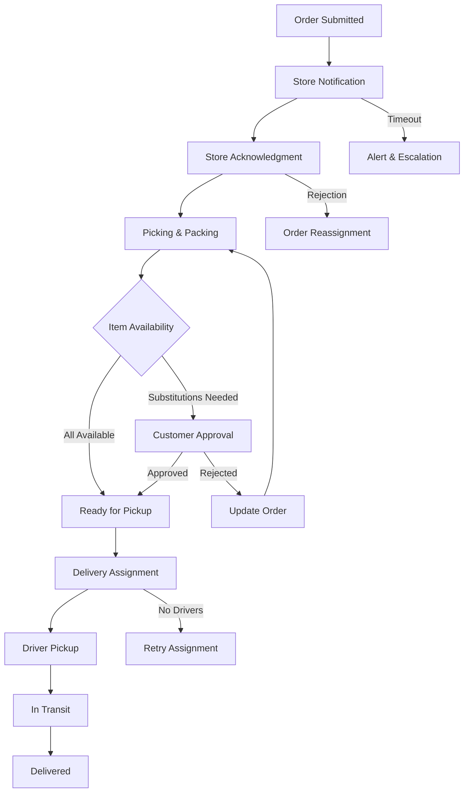

# Order Tracking Service Documentation

## Overview
The Order Tracking Service is a high-throughput microservice that manages the complete lifecycle of order fulfillment, from initial submission to final delivery. It provides real-time tracking, status updates, and integration with store operations and delivery partners (DoorDash, Uber).

## Features
- Real-time order status tracking
- Store acknowledgment and fulfillment tracking
- Delivery partner integration and GPS tracking
- Comprehensive audit trail
- Real-time notifications
- SLA monitoring and alerts
- Inventory adjustment tracking
- Substitution management

## Order Lifecycle Flow


## Components

### 1. Order Status Models

#### OrderTrackingStatus
```python
class OrderTrackingStatus(str, Enum):
    SUBMITTED = "submitted"
    STORE_NOTIFIED = "store_notified"
    STORE_ACKNOWLEDGED = "store_acknowledged"
    PICKING_IN_PROGRESS = "picking_in_progress"
    SUBSTITUTIONS_NEEDED = "substitutions_needed"
    SUBSTITUTIONS_APPROVED = "substitutions_approved"
    READY_FOR_PICKUP = "ready_for_pickup"
    DRIVER_ASSIGNED = "driver_assigned"
    DRIVER_PICKUP_COMPLETE = "driver_pickup_complete"
    IN_TRANSIT = "in_transit"
    DELIVERED = "delivered"
    CANCELLED = "cancelled"
    FAILED = "failed"

class DeliveryProvider(str, Enum):
    UBER = "uber"
    DOORDASH = "doordash"
    INTERNAL = "internal"

class SubstitutionStatus(str, Enum):
    PENDING = "pending"
    APPROVED = "approved"
    REJECTED = "rejected"
```

#### OrderTracking
```python
class OrderTracking(BaseModel):
    id: str = Field(default_factory=lambda: str(ObjectId()))
    order_id: str
    store_id: str
    customer_id: str
    delivery_provider: DeliveryProvider
    current_status: OrderTrackingStatus
    status_history: List[OrderStatusUpdate]
    store_acknowledgment_time: Optional[datetime]
    picking_start_time: Optional[datetime]
    picking_complete_time: Optional[datetime]
    delivery_pickup_time: Optional[datetime]
    estimated_delivery_time: Optional[datetime]
    actual_delivery_time: Optional[datetime]
    delivery_tracking_id: Optional[str]
    delivery_tracking_url: Optional[str]
    driver_location: Optional[GeoLocation]
    driver_details: Optional[DriverDetails]
    substitutions: List[ItemSubstitution]
    issues: List[OrderIssue]
    metadata: Dict[str, Any]
    created_at: datetime = Field(default_factory=datetime.utcnow)
    updated_at: datetime = Field(default_factory=datetime.utcnow)

class OrderStatusUpdate(BaseModel):
    status: OrderTrackingStatus
    timestamp: datetime
    updated_by: str
    notes: Optional[str]
    metadata: Dict[str, Any]

class ItemSubstitution(BaseModel):
    original_item_id: str
    substitute_item_id: str
    reason: str
    status: SubstitutionStatus
    price_difference: float
    customer_notified_at: Optional[datetime]
    customer_responded_at: Optional[datetime]

class OrderIssue(BaseModel):
    issue_type: str
    description: str
    severity: str
    created_at: datetime
    resolved_at: Optional[datetime]
    resolution: Optional[str]

class GeoLocation(BaseModel):
    latitude: float
    longitude: float
    timestamp: datetime
    accuracy: Optional[float]

class DriverDetails(BaseModel):
    driver_id: str
    name: str
    phone: str
    vehicle_type: str
    vehicle_number: Optional[str]
    photo_url: Optional[str]
```

## API Endpoints

### Order Tracking Management
```python
POST /tracking/orders/{order_id}/init
PUT /tracking/orders/{order_id}/status
GET /tracking/orders/{order_id}
GET /tracking/orders/{order_id}/history
GET /tracking/orders/{order_id}/live-location

# Store Operations
POST /tracking/store/{store_id}/acknowledge
POST /tracking/store/{store_id}/start-picking
POST /tracking/store/{store_id}/substitution
POST /tracking/store/{store_id}/ready

# Delivery Operations
POST /tracking/delivery/{order_id}/assign
PUT /tracking/delivery/{order_id}/location
POST /tracking/delivery/{order_id}/pickup
POST /tracking/delivery/{order_id}/delivered

# Webhooks
POST /tracking/webhooks/uber
POST /tracking/webhooks/doordash
```

## Database Schema

### Order Tracking Collection
```
order_tracking
├── order_id (unique index)
├── store_id (index)
├── customer_id (index)
├── current_status (index)
├── delivery_provider
├── status_history: [
│   ├── status
│   ├── timestamp
│   ├── updated_by
│   └── metadata
│ ]
├── store_acknowledgment_time
├── picking_start_time
├── picking_complete_time
├── delivery_pickup_time
├── estimated_delivery_time
├── actual_delivery_time
├── delivery_tracking_id
├── delivery_tracking_url
├── driver_location
├── driver_details
├── substitutions
├── issues
├── metadata
├── created_at
└── updated_at
```

## High Availability & Scalability

### Data Consistency
- Event sourcing pattern for status updates
- Optimistic locking for concurrent updates
- Idempotency keys for API operations
- Write-ahead logging

### Performance Optimization
- Read replicas for tracking queries
- Caching layer for active orders
- Materialized views for analytics
- Batch processing for historical data

### Scalability Measures
- Horizontal scaling of service instances
- Database sharding by store_id
- Message queue for async processing
- CDN for delivery tracking URLs

## Error Handling & Recovery

### Failure Scenarios
- Store acknowledgment timeout
- Delivery partner API failures
- GPS tracking gaps
- Database connection issues
- Message queue failures

### Recovery Procedures
1. Automatic retry with exponential backoff
2. Circuit breaker for external services
3. Fallback to secondary providers
4. Manual intervention triggers
5. Data reconciliation jobs

## Monitoring & Alerting

### Key Metrics
- Order processing time per stage
- Store acknowledgment SLA
- Delivery ETA accuracy
- System error rates
- API latency

### Real-time Alerts
- SLA violations
- Failed deliveries
- System degradation
- Data inconsistencies
- Integration failures

## Integration Points

### Internal Services
- Order Service
- Store Service
- Customer Service
- Notification Service

### External Services
- Uber Delivery API
- DoorDash API
- GPS Tracking Service
- Analytics Platform

## Security

### Data Protection
- PII encryption
- Location data protection
- Audit trail immutability
- Access control per store

### API Security
- Rate limiting
- Request validation
- Authentication per provider
- Webhook verification

## Disaster Recovery

### Backup Procedures
- Real-time data replication
- Point-in-time recovery
- Regular backup testing
- Cross-region failover

### Service Resilience
- Multi-region deployment
- Automatic failover
- Data center redundancy
- Service discovery 