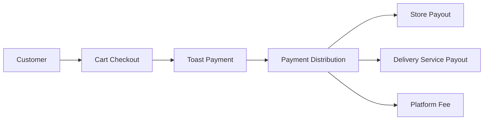

# Payment System Documentation

## Overview
The payment system handles all financial transactions in the grocery delivery platform, including customer payments, store payouts, and delivery service compensation. It integrates with Toast for payment processing and maintains a comprehensive audit trail.

## Payment Flow


## Key Components

### 1. Payment Models

#### Transaction
Main record of a payment transaction:
```python
class Transaction:
    id: str
    order_id: str
    cart_id: str
    payment_type: PaymentType
    payment_method: PaymentMethod
    amount: float
    status: PaymentStatus
    distributions: List[PaymentDistribution]
    metadata: dict
    error_message: Optional[str]
    created_at: datetime
    updated_at: datetime
    completed_at: Optional[datetime]
```

#### Payment Distribution
Handles payment splitting between parties:
```python
class PaymentDistribution:
    party_id: str
    party_type: PaymentPartyType
    amount: float
    status: PaymentStatus
    payout_id: Optional[str]
    created_at: datetime
    completed_at: Optional[datetime]
```

#### Payment Audit
Tracks all payment-related events:
```python
class PaymentAudit:
    id: str
    transaction_id: str
    event_type: str
    status: PaymentStatus
    amount: float
    metadata: dict
    created_at: datetime
```

### 2. Payment Methods
- Toast integration
- Credit Card
- Debit Card

### 3. Payment Types
- `CHARGE`: Customer payments
- `PAYOUT`: Payments to stores/delivery services

### 4. Party Types
- Customer
- Store
- Delivery Service
- Platform

## Payment Process

### 1. Customer Payment Flow
```python
# Process payment through Toast
response = await toast_client.post("/payments", {
    "amount": amount,
    "currency": "USD",
    "payment_token": token,
    "description": description
})

# Create transaction and distributions
transaction = Transaction(...)
transaction.distributions = [
    PaymentDistribution(store),
    PaymentDistribution(delivery),
    PaymentDistribution(platform)
]

# Create audit record
await create_audit(...)
```

### 2. Payout Process
```python
# Send payout request to Toast
response = await toast_client.post("/payouts", {
    "amount": amount,
    "currency": "USD",
    "destination": party_id
})

# Update distribution status
distribution.status = COMPLETED

# Create audit record
await create_audit(...)
```

## Fee Structure

### Standard Rates
- Platform Fee: 5% of subtotal
- Tax Rate: 8%
- Delivery Fee: Variable (set by delivery service)
- Store Amount = Subtotal - Platform Fee

### Example Calculation
For a $100 order with $10 delivery fee:
```python
total_amount = 100
delivery_fee = 10

# Calculations
platform_fee = total_amount * 0.05  # $5
tax = total_amount * 0.08  # $8
store_amount = total_amount - platform_fee  # $95
final_total = total_amount + delivery_fee + tax  # $118

# Distribution
- Customer pays: $118
- Store receives: $95
- Delivery service receives: $10
- Platform receives: $5
- Tax collected: $8
```

## Database Structure

### MongoDB Collections
```
transactions
├── order_id (indexed)
├── cart_id (indexed)
└── created_at (indexed)

payment_audits
├── transaction_id (indexed)
└── created_at (indexed)
```

## Error Handling

### Payment Failures
- Failed transactions are recorded with status `FAILED`
- Detailed error messages are stored in `error_message`
- Audit trail maintains failure records
- Exception details captured in metadata

### Recovery Process
1. Failed transactions can be retried
2. Audit trail helps in debugging issues
3. Automatic notification system for failed payments
4. Manual intervention possible for complex cases

## Security Features

### Authentication & Authorization
- Toast API authentication
- Secure token handling
- Party verification

### Data Security
- Amount validation
- Comprehensive audit logging
- Secure credential storage
- Transaction metadata encryption

## Monitoring & Reporting

### Key Metrics
- Transaction success rate
- Average processing time
- Payout completion rate
- Error frequency

### Audit Trail
Every payment action is logged with:
- Transaction ID
- Event Type
- Status
- Amount
- Metadata
- Timestamp

## Integration Points

### External Services
- Toast Payment Gateway
- Banking Systems
- Store Management System
- Delivery Service APIs

### Internal Services
- Order Management
- Cart Service
- User Authentication
- Notification Service 